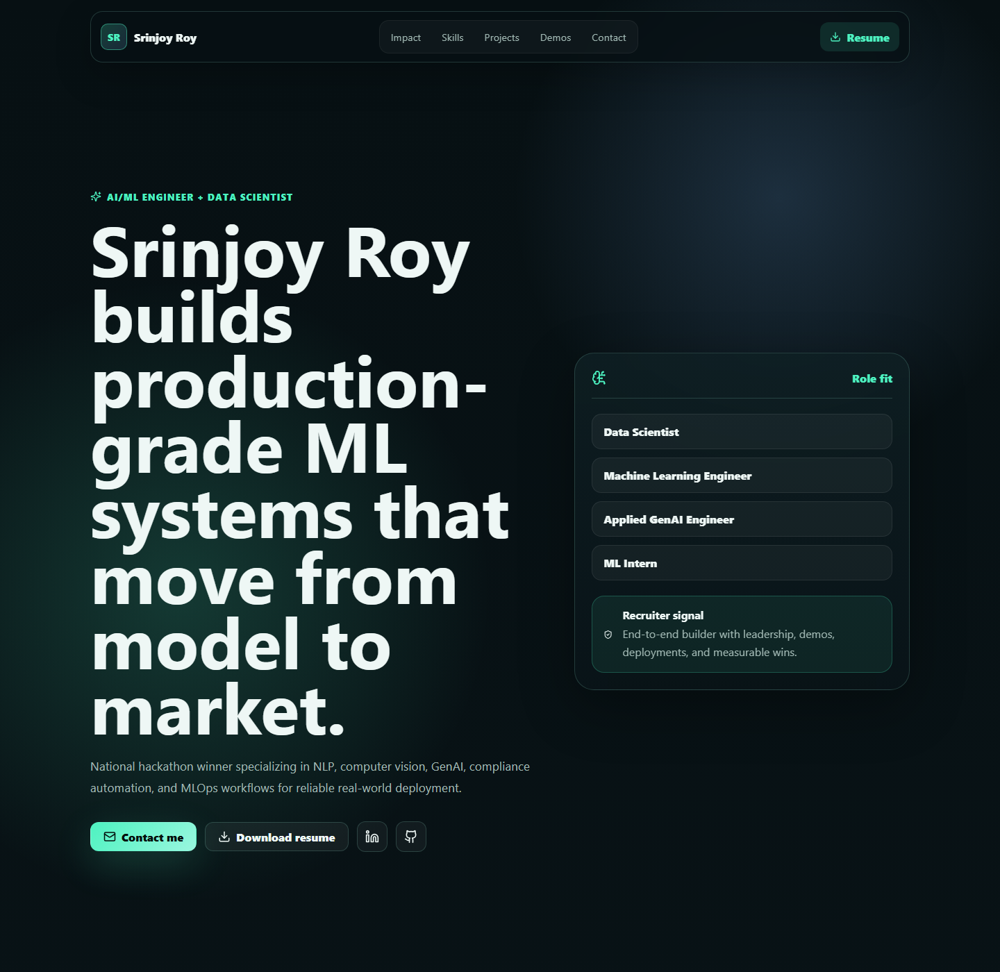
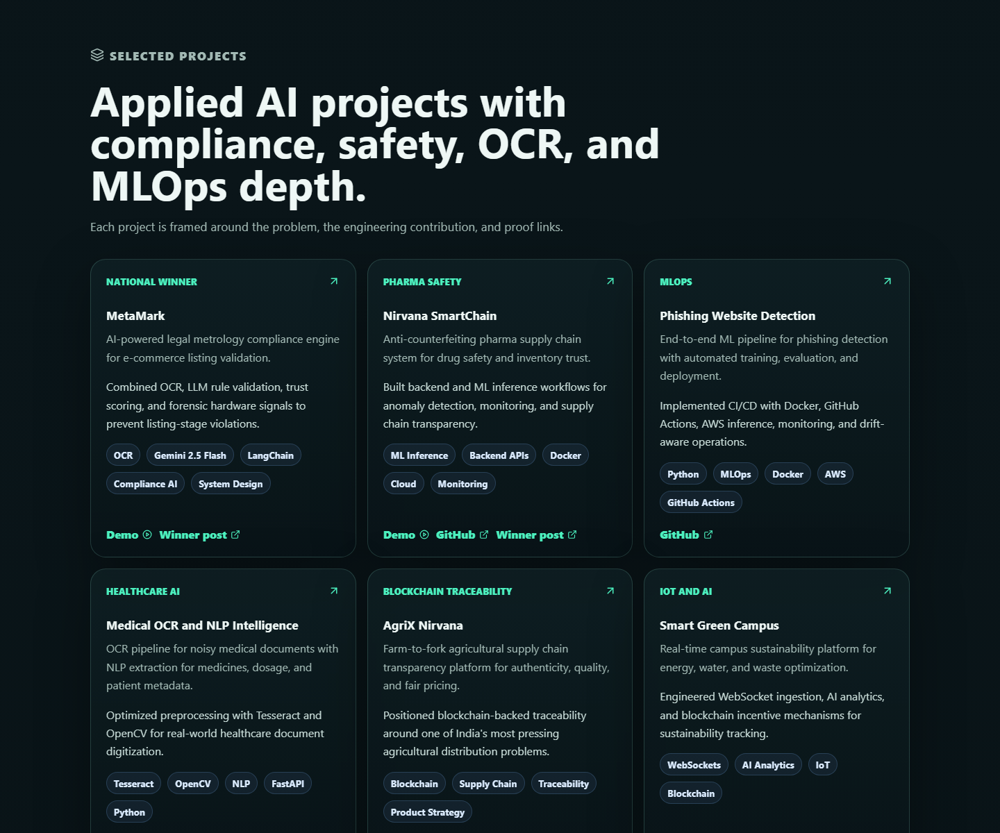
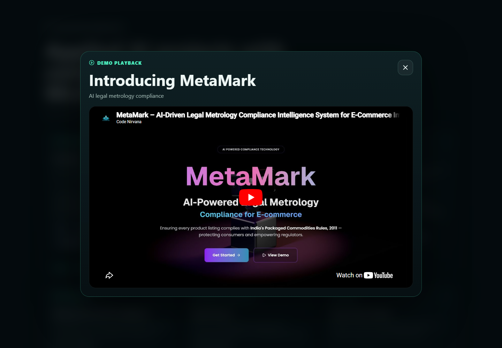

# Srinjoy Roy Portfolio

A modern, animated portfolio website for Srinjoy Roy, built for Data Scientist, Machine Learning Engineer, Applied GenAI Engineer, and ML Intern opportunities. The site highlights national hackathon wins, production ML/MLOps experience, GenAI systems, OCR/NLP work, and communication demos.

## Screenshots

### Hero



### Featured Projects



### Video Popup



## Features

- Executive dark AI visual design with responsive layouts.
- Recruiter-first sections for impact, skills, projects, demos, experience, education, and contact.
- Animated scroll reveals and subtle card interactions.
- Embedded YouTube demo playback in an on-site popup modal.
- Resume download from `public/srinjoy_roy_resume_final.pdf`.
- Deep links for sections and demo popups, including `/#projects` and `/#demo-metamark`.
- Reduced-motion support for accessibility.

## Tech Stack

- React
- Vite
- JavaScript
- CSS
- Lucide React icons

## Getting Started

Install dependencies:

```bash
npm install
```

Run the development server:

```bash
npm run dev
```

Open the local site:

```text
http://127.0.0.1:5173
```

If that port is already busy, Vite may use another port. In this workspace, the site has also been tested on:

```text
http://127.0.0.1:5181
```

## Available Scripts

```bash
npm run dev
npm run build
npm run lint
npm run preview
```

## Project Structure

```text
.
+-- docs/screenshots/          # README screenshots
+-- public/                    # Static assets, including resume PDF
+-- src/main.jsx               # Portfolio content and React components
+-- src/styles.css             # Visual system, layout, animation, modal styles
+-- index.html
+-- package.json
+-- vite.config.js
```

## Verification

The current build was checked with:

```bash
npm run lint
npm run build
```
